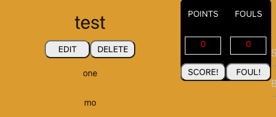

Introduction:

Welcome to Alley Scoop!

App creates a community of people to view and comment on their favorite Sports news of the day. We have created Like/dislike buttons for posts; like a scoreboard, points are in basketball (1,2,3). Continuous flow and scroll for the users’ posts. Enjoy!

Technologies Used:

Bcrypt / JWT

MERN Stack 

Heroku

NewsAPI

Getting Started: 

Deployed app:
https://vast-brushlands-52387.herokuapp.com/

Trello board:
https://trello.com/b/RtzoYsUc/project-planning

Unsolved Problems: List any unsolved issues.

Future Enhancements: Identify future features and enhancements planned for the project.

Authors:
Matt D.
Matt S.
Yogesh N.
mehari A.
