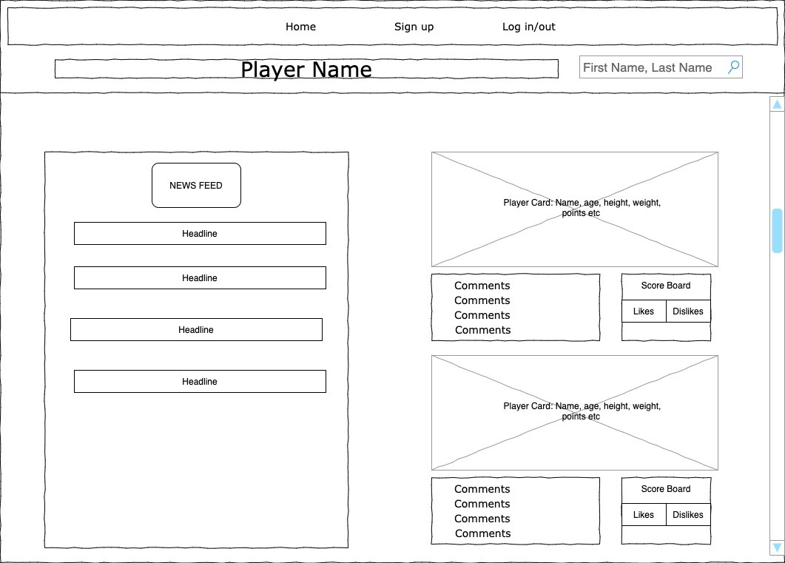
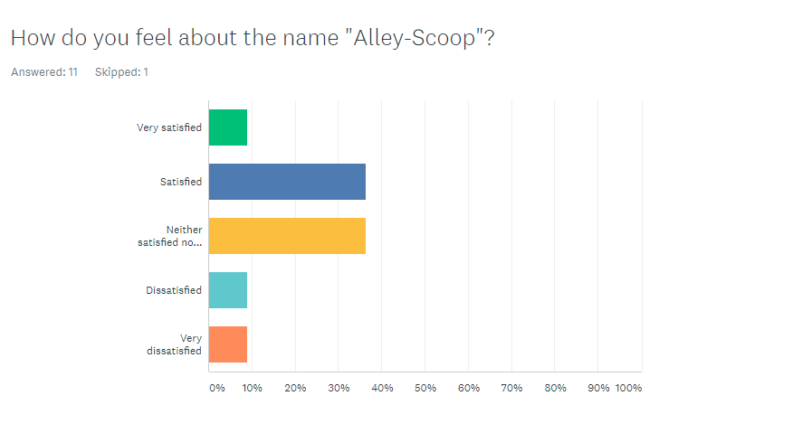
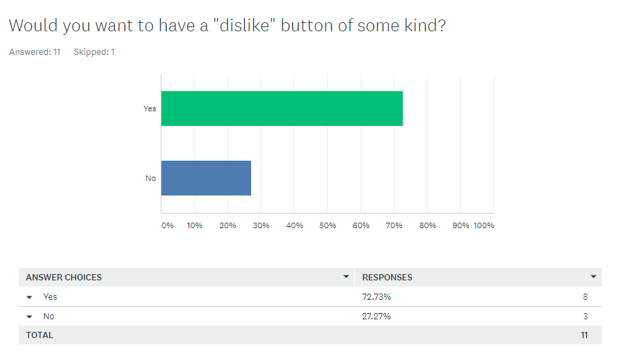
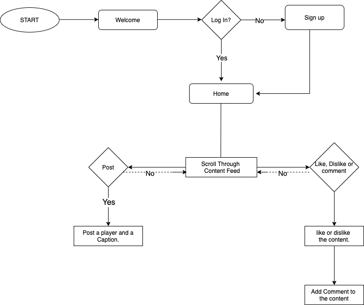

Introduction:

Welcome to Alley Scoop!

App creates a community of people to view and comment on their favorite Sports news of the day. We have created Like/dislike buttons for posts; like a scoreboard, points are in basketball (1,2,3). Continuous flow and scroll for the users’ posts. 

To use the app, navigate to the deployed website and register a unique user profile. You will automatically be redirected to the homepage where you can view the news feed and forum side by side. Users may log out at anytime and your information is stored for up to 24 hours before you need to log in again. 

Enjoy!

Technologies Used:

Bcrypt / JWT

MERN Stack 

Heroku

NewsAPI

Getting Started: 

Deployed app:
https://vast-brushlands-52387.herokuapp.com/

Trello board:
https://trello.com/b/RtzoYsUc/project-planning

Unsolved Problems: List any unsolved issues.

Points are not included in the user object so they do not save on reload 

News API does not work with deployment unless we purchase a subscriptions (cors limitation)

Linking user name to each comment and post

preventing users from editing other users posts (unfettered CRUD)

Future Enhancements: Identify future features and enhancements planned for the project.

More thoughtful UI/UX
Add dual scrolling
Connect articles to commments/posts though search feature 
Friends list for users
Sound/video clips

Authors:
Matt D.
Matt S.
Yogesh N.
mehari A.

License MIT 